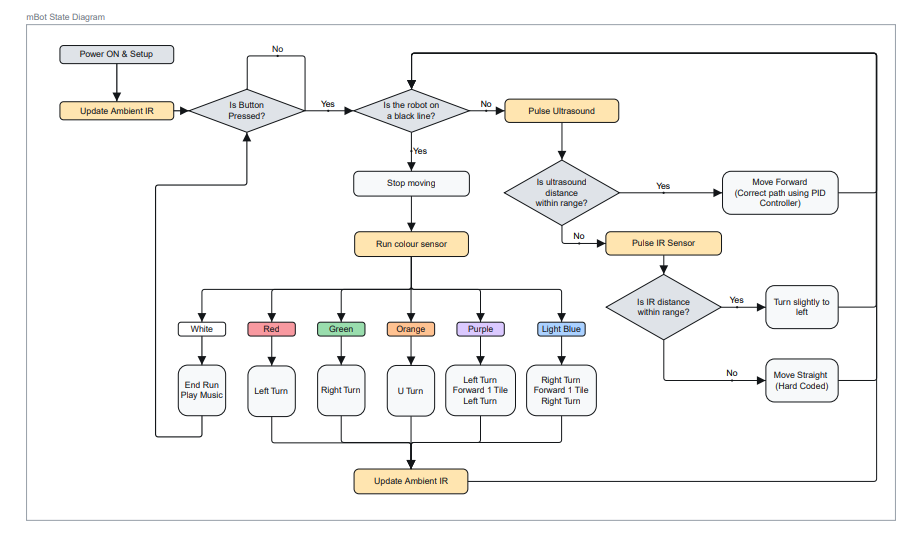

# CG1111A-Final-Project
Objective: Construct and program an autonomous robot to solve a maze, detect and process data from the environment using Arduino Uno.

Maze deliverables include colour classification and wall avoidance.
+ Colour classification is done using K-Nearest Neighbours algorithm.
+ Wall avoidance is done using PD control on ultrasound distance measurement.
+ IR proximity sensor is used for wall avoidance, but only in the event PD control fails.

## File Description
+ mbot_project_final.ino: Final Code for Maze Solving Robot
+ Notes.h: Contains music notes for buzzer

## Makeblock Libraries
[Link to Makeblock Libraries](https://github.com/Makeblock-official/Makeblock-Libraries/tree/master).

## State Diagram (Maze Solving Algorithm)

